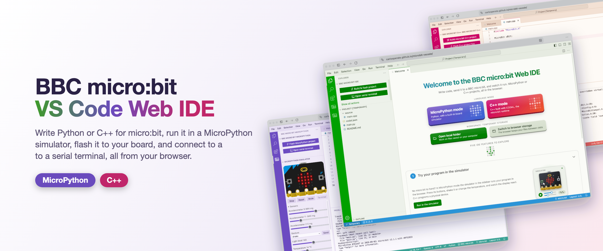

# BBC micro:bit VS Code Web IDE



A browser-based VS Code instance, deployed as a static site to GitHub Pages,
pre-configured for BBC micro:bit MicroPython and C++ development.

> **Status:** Early WIP development.

https://carlosperate.github.io/microbit-vscode/


## Run locally

```sh
npm install
npm run build
npm run dev
```

Then open <http://localhost:8080/>.

Developer documentation is available in the [dev.md](dev.md) file.

## License and acknowledgements

This project is licensed under the MIT License. See the [LICENSE](./LICENSE) file for details.

This project wouldn't be possible without the following open source projects:

- [Microsoft VS Code](https://github.com/microsoft/vscode): The underlying editor (MIT).
- [Felx-B/vscode-web](https://github.com/Felx-B/vscode-web): The bootstrap patch this VS Code build adapts (MIT).
- [Open VSX](https://open-vsx.org/): The VS Code extension marketplace this build uses.
- The following VS Code extensions included in the build:
  [VS Code micro:bit Manager](https://github.com/carlosperate/vscode-microbit-manager),
  [VS Code micro:bit MicroPython](https://github.com/carlosperate/vscode-microbit-micropython),
  [VS Code micro:bit C++](https://github.com/carlosperate/vscode-microbit-cpp),
  [VS Code micro:bit Themes](https://github.com/carlosperate/vscode-microbit-themes),
  [VS Code MicroPython LSP](https://github.com/carlosperate/vscode-micropython-lsp),
  [VS Code Serial Monitor](https://github.com/eclipse-cdt-cloud/vscode-serial-monitor).
  [VS Code C/C++- Themes](https://github.com/Microsoft/vscode-cpptools)
- And the micro:bit related projects these VS extensions were built on top of:
  [microbit-clang-wasm](https://github.com/carlosperate/microbit-clang-wasm),
  [microbit-clang-wasm-codal](https://github.com/carlosperate/microbit-clang-wasm-codal),
  [microbit-connection](https://github.com/microbit-foundation/microbit-connection),
  [micropython-microbit-v2-simulator](https://github.com/microbit-foundation/micropython-microbit-v2-simulator),
  [microbit-universal-hex](https://github.com/microbit-foundation/microbit-universal-hex),
  [microbit-fs](https://github.com/microbit-foundation/microbit-fs).

